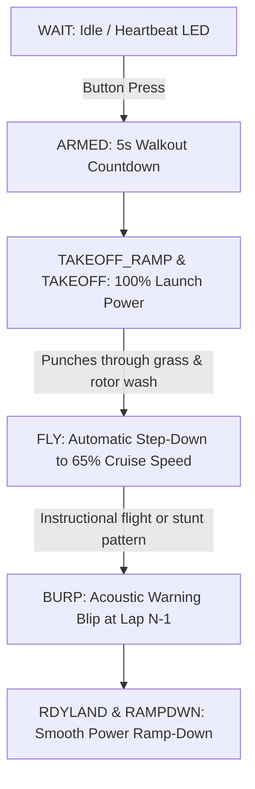

# Smart Electric Power at EAA KidVenture: 1,500 Flights with the Cheesehead Timer

**By David Siegler, AMA NE9N**  
*Circlemasters Control Line Club*  
*For submission to Model Aviation Magazine*

---

```
  +-------------------------------------------------------------------------+
  |              EAA KIDVENTURE & CHEESEHEAD TIMER OVERVIEW                 |
  |                                                                         |
  |   • 30+ Years of Service by the Circlemasters Control Line Club         |
  |   • 1,500+ First-Time Youth Participants Every Summer at Oshkosh        |
  |   • 1 Pit Person per Circle (Down from 3-Man Glow Starting Crews)       |
  |   • 7 Full Training Flights on a Single 3S 2,200 mAh LiPo Battery       |
  |   • Full-Power Takeoff to Punch Through Helicopter Rotor Wash & Grass   |
  |   • Automatic Throttle Step-Down to a Gentle 90-Second Training Cruise  |
  |   • Millisecond IMU Pitch Cutoff to Prevent Burned Motor Windings       |
  |   • Active Gyro Maneuver Boost & Pitch Trim for Sport and Stunt Flying  |
  +-------------------------------------------------------------------------+
```

---

## The Spark in the Czech Republic

In aeromodeling, inspiration often comes from unexpected places. In the winter of 2017, I had the opportunity to attend an international indoor Control Line (CL) stunt contest in the Czech Republic. For those accustomed to flying outdoors on long grass circles, watching high-precision aerobatic models fly inside a gymnasium on thin lines was eye-opening.

What stood out most was the cutting-edge electric power management. European innovators were integrating miniature microcontrollers and inertial sensors to actively adjust motor output throughout the flight. The motor delivered extra power at the precise moment the model entered a sharp corner, then automatically stabilized airspeed on level laps.

Watching those models carve clean square corners inside that sports hall sparked an idea: *Could we adapt this intelligent, sensor-driven technology to solve the tough flight-line challenges we face back home—both in precision stunt and on our high-volume youth training circles?*

---

## Thirty Years of Circles at EAA KidVenture

Back in Wisconsin, the **Circlemasters Control Line Club** has maintained a dedicated presence at the Experimental Aircraft Association (EAA) AirVenture fly-in in Oshkosh for more than three decades. Long before modern brushless motors, lithium batteries, or microcontrollers existed, club members brought trainers to **KidVenture** with a singular mission: to give young people their very first hands-on experience controlling a flying model airplane.

Over thirty years of continuous service, the Circlemasters' introductory flight circle has introduced tens of thousands of youngsters to aviation. During a single week at AirVenture, our volunteer crew—joined by experienced modelers from across the United States and around the world who travel to Oshkosh to help—conducts **more than 1,500 introductory flights**. The vast majority of these young flyers have *never touched or flown a model airplane before*.

Watching a child's face light up when they feel line tension and realize they are commanding an aircraft is unforgettable. However, sustaining 1,500 flights across seven days in the demanding Oshkosh environment requires an exceptionally efficient, reliable, and durable flight-line operation.

---

## Retiring the Glow Fleet: From 3 Pit Hands Down to 1

For decades, the Circlemasters relied on small **Norvel .061 glow engines** to power our fleet of trainers. While these engines served faithfully, operating them at such high volume was demanding and labor-intensive:

* **Three-Person Ground Crews:** Every flight required three volunteer club members per circle: one to prime and fuel, one to hold the starter battery and electric starter, and one to restrain and launch the model.
* **Flight-Line Bottlenecks:** Managing temperamental needle valves, hot cylinder heads, flooded engines, and refueling after every 90-second flight created constant delays.
* **Exhaust and Cleanliness:** Handling oily airplanes while coaching excited children made for long, messy days on the circle.

We recognized that transitioning to Electric Control Line (ECL) was the right path. However, standard commercial electric timers were too rigid for the unique physical realities of the Oshkosh flight line. 

Over three summers of field testing and refinement at AirVenture, we developed the **Cheesehead Timer**, an open-source Arduino-based controller (available on [GitHub](https://github.com/ne9n/new-timer)). The transition to smart electric power transformed our flight-line operations:

1. **One-Person Pit Operation:** Instead of three volunteers managing fuel and starters, **only a single pit person is now needed**. The pit person sets the model down, presses a single fuselage button, and steps clear.
2. **Seven Flights on One Pack:** Powered by an inexpensive, off-the-shelf **3S 2,200 mAh Lithium Polymer (LiPo)** battery and a budget 2212-size brushless motor, the trainer achieves **seven complete 90-second training flights** before needing a battery swap.
3. **Rapid Turnarounds:** As soon as one student lands, the next student takes the handle, the button is pressed, and the flight begins within seconds. This allows our remaining volunteers to focus entirely on one-on-one student coaching.

---

## Two-Stage Throttle: Launch Power vs. Training Speed

The KidVenture flight circle sits near active full-scale helicopter flight corridors. Passing rotor wash, gusty Midwestern summer crosswinds, and thick turf create severe low-level turbulence across the circle.

In electric training, finding the right motor output is a delicate balancing act:
* If launched at a gentle, beginner-friendly cruise speed, the model struggles to accelerate through thick grass, sags on the lines in crosswinds, and can be flipped by helicopter downwash.
* If run at full throttle for the entire flight, the airplane flies at 50 to 60 miles per hour—far too fast for a newcomer to control safely.
* If an instructor tries to hold an auxiliary throttle lever while coaching, their attention is divided right when the student needs close, hands-on guidance.

```
       +--------------------------------------------------------------+
       |                  TWO-STAGE FLIGHT THROTTLE PROFILE           |
       |                                                              |
 100%  |     /------------\ (Stage 1: Launch through rotor wash)      |
       |    /              \                                          |
       |   /                \                                         |
  65%  |  /                  \=======================\ (Stage 2: Cru.)|
       | /                                            \---\ (Burp)    |
       |/                                                  \_______   |
       +--------------------------------------------------------------+
         [ RAMP ] [ TAKEOFF ]      [ INSTRUCTIONAL CRUISE ]   [ LAND ]
```

The Cheesehead Timer solves this with an automated **two-stage throttle sequencer**:

1. **Stage 1 (Full-Power Launch):** At startup, the timer commands the Electronic Speed Control (ESC) to 100% maximum launch power (`curThrottle = 160+`). The propeller delivers immediate static thrust that pulls the airplane cleanly off the turf, punches through rotor wash, and locks in solid line tension.
2. **Stage 2 (Calm Instructional Cruise):** After two to three seconds—once the model is safely airborne at shoulder height—the timer automatically throttles back to a mild 65% training speed. At this relaxed pace, the beginner has plenty of reaction time to master level flight and gentle climbs.
3. **The Warning "Burp":** Exactly one lap before shutdown, the timer delivers a brief throttle surge (the `BURP` state), giving instructor and student an acoustic cue to level out for landing.
4. **Landing (`RAMPDWN`):** The motor ramps down smoothly, allowing the airplane to glide in for a gentle touchdown on its gear.

---

## Motor Protection: Preventing High-Stall Burnouts

One of the most critical lessons we learned early in our electric transition involved crash dynamics. 

With a glow engine, an accidental ground strike stops the propeller and stalls the engine safely. With a brushless electric power system, behavior is entirely different. If a student over-controls and the airplane hits the grass while the timer commands full power, the propeller is locked in the turf while the ESC continues pumping electrical power into the motor.

Within three to four seconds of this **high locked-rotor stall current**, the fine enameled copper wire in a small brushless motor overheats, melting insulation, shorting stator windings, and often destroying the ESC.

To eliminate this costly failure mode, we integrated an MPU-6050 six-axis Inertial Measurement Unit (IMU) on the $I^2C$ bus:

```
                      +----------------------------------+
                      |         GROUND STRIKE /          |
                      |         PROPELLER STALL          |
                      +-----------------+----------------+
                                        |
               +------------------------+------------------------+
               |                                                 |
               v                                                 v
    [ TRADITIONAL DUMB TIMER ]                       [ CHEESEHEAD SMART TIMER ]
    • Motor held at full power                       • IMU detects >40° pitch spike
    • Massive locked-rotor stall current             • Shuts off ESC in milliseconds
    • Melted windings & smoked ESC                   • Zero motor or ESC damage!
```

* **Pitch Delta Cutoff (`PitchEX`):** A sudden pitch angular change ($>40^\circ$) from a ground impact cuts ESC throttle to zero within milliseconds, saving the motor and ESC.
* **Low-Yaw Cutoff (`YawLOW`):** If the model stops rotating in the circle, power cuts immediately to prevent propeller strikes on the grass.
* **Line-Break / In-Circle Turn Cutoff (`YawEX`):** If the airplane suffers a line break or turns inward toward the center of the circle, the anomalous yaw/roll rate triggers an immediate motor shutdown to protect participants, spectators, and equipment.

---

## Expanding to Sport and Stunt Operation

While designed for high-volume training, the Cheesehead Timer is equally valuable for **sport flying** and **Precision Aerobatics (Stunt)**. In traditional glow stunt, pilots relied on the classic "4-2-4" engine break to deliver extra power in climbs and maneuvers. The timer recreates and enhances this behavior electronically using two built-in gyro algorithms in `gyro.cpp`:

* **Maneuver Power Boost (`maneuverBoost`):** When the pilot deflects the elevator for sharp square corners, inside/outside loops, or vertical eights, the MPU-6050 detects the high pitch rate and commands an instantaneous burst of throttle. This delivers extra thrust at the apex of the maneuver to overcome induced drag and maintain line tension. Sensitivity is adjustable via the serial command `K <value>`.
* **Sinusoidal Pitch Trim (`posTrim`):** The timer reads vertical pitch angle in real time, increasing throttle during vertical climbs to combat gravity, and reducing power on vertical dives to maintain uniform lap speeds across the entire flight profile.
* **Lap-Based Flight Termination:** In addition to elapsed time, the timer can terminate flights based on exact MPU yaw lap counts (e.g., 5.0 laps), ensuring consistent aerobatic flight profiles regardless of wind speeds.

---

## Hardware Architecture & Firmware Design

We designed the hardware around low-cost, off-the-shelf components so any club or individual modeler can easily replicate and customize the system:

```
+--------------------------------------------------------------------------+
|                       CHEESEHEAD TIMER HARDWARE MAP                      |
+--------------------------------------------------------------------------+
|  Controller:         Arduino Nano V3 (ATmega328P) or ESP32 Module        |
|  Attitude Sensor:    MPU-6050 6-Axis Gyro/Accelerometer Breakout ($I^2C$) |
|  Carrier Board:      Custom PCB with LED, Button, and Servo headers      |
|  ESC Interface:      Arduino Servo Library (50Hz PWM Output)             |
|  Power Package:      Budget 2212 Outrunner + 30A ESC + 3S 2,200 mAh LiPo |
|  Status LEDs:        Red (Idle/Error), Yellow (Armed), Green (Running)   |
|  User Input:         Single Miniature Push Button (Debounced / Pin 10)   |
+--------------------------------------------------------------------------+
```

### 1. The Microcontroller & Carrier Board
The firmware runs on an **Arduino Nano V3** (ATmega328P) or **ESP32**. To eliminate fragile point-to-point wiring in high-vibration airframes, we developed a **small custom carrier Printed Circuit Board (PCB)**. The board sockets the Arduino Nano and MPU-6050, breaking out:
* Polarized headers for three status Light Emitting Diodes (LEDs).
* A dedicated connector for the fuselage push button.
* A standard 3-pin male servo header that connects directly to the ESC throttle lead.

### 2. State Machine Firmware
The C++ firmware (`state_machine.cpp`) implements a clean Finite State Machine (FSM):



### 3. ESC Control via the Arduino Servo Library
The timer uses the standard **Arduino `Servo` library** (`#include <Servo.h>`) to output standard 50 Hz Pulse Width Modulation (PWM) signals ($1000\,\mu\text{s}$ at idle to $2000\,\mu\text{s}$ at full throttle). This makes the timer universally compatible with standard commercial RC speed controllers.

### 4. Desktop Workbench GUI
Between flight sessions, instructors connect the timer to a laptop via USB and use the companion Python/CustomTkinter desktop application (`desktop_app.py`).

```
+-------------------------------------------------------------------------+
| [●] CHEESEHEAD TIMER WORKBENCH - TRAINER & STUNT PROFILES           _ □ X |
+-------------------------------------------------------------------------+
| Port: [ COM3 (Arduino Nano) ▼ ] [ CONNECTED ] [ READ EEPROM ] [ SAVE ]  |
+------------------------------------+------------------------------------+
| LIVE TELEMETRY                     | FLIGHT PHASE CONFIGURATION (EEPROM)|
|                                    |                                    |
| Flight State:  FLY (Active Gyro)   | Launch Throttle (PWM): [ 165 ]     |
| Active Power:  125 / 180           | Base Cruise Throttle:  [ 115 ]     |
| Maneuver Boost:+15 (Active)        | Maneuver Gain (rx):    [ 25  ]     |
| Pitch / Yaw:   +18.4° / 14.2°/s    | Pitch Trim Gain (px):  [ 15  ]     |
| Lap Progress:  3.4 / 5.0 Laps      | Target Flight Laps:    [ 5.0 ]     |
| Flight Timer:  48s / 90s Limit     | Arming Walkout Delay:  [ 5.0s]     |
|                                    | Pre-Landing Warning:   [ ENABLED ] |
| [ ZERO SENSORS ] [ LIVE PLOTTER ]  | [ WRITE CONFIG TO EEPROM ]         |
+------------------------------------+------------------------------------+
```

The GUI provides real-time sensor graphs, calibration tools, and one-click EEPROM parameter flashing, allowing flight parameters to be updated in seconds.

---

## Future Enhancements

Development continues to make the system even more versatile:

* **Automated Gyro Lap Counting & Lap-Time Logging:** Using onboard yaw rate integration ($360^\circ = 1.0\text{ lap}$ count), future updates will add lap-by-lap timing analytics and automatic lap-based flight termination, guaranteeing identical flight experiences regardless of wind conditions.
* **Wireless Interface for Field Setup:** Integrating Bluetooth or Wi-Fi connectivity (via ESP32) will allow flight leaders to adjust flight times, launch thrust, and cruise speeds directly from a smartphone or tablet in the pit without plugging in cables.
* **Direct ESC Telemetry & Fault Control:** Direct digital two-way communication with the ESC will enable real-time monitoring of motor current, temperature, and fault codes to catch issues before hardware is damaged.
* **Active RPM Compensation:** As battery voltage gradually drops across seven flights on a single pack, closed-loop Revolutions Per Minute (RPM) compensation will dynamically adjust throttle to maintain constant propeller speed and identical lap times from the first flight to the last.
* **More Compact Hardware:** An integrated, all-in-one surface-mount PCB is in development to combine the microcontroller, IMU, power regulation, and headers into an ultra-compact, featherweight footprint suitable for smaller sport models.

---

## Conclusion: A Global Community Effort

The success of the KidVenture training circle is made possible by the dedication of the aeromodeling community. Modelers from across the globe volunteer their time as pilots and ground crew each summer, united by a passion for sharing aviation with the next generation.

By automating launch thrust, reducing student flight speed, protecting motors from crash damage, and supporting advanced stunt and sport capabilities, the Cheesehead Timer offers a proven, accessible solution for every level of Control Line flying.

---

## Photo Captions

* **Photo 1 (`fig1_kidventure_line.jpg`):**  
  *Caption:* A volunteer instructor guides a first-time pilot at EAA KidVenture during a 90-second introductory flight. (16 words)

* **Photo 2 (`fig2_launch_sequence.jpg`):**  
  *Caption:* The trainer launches at full power to overcome grass drag and helicopter turbulence before stepping down to cruise speed. (20 words)

* **Photo 3 (`fig3_carrier_board.jpg`):**  
  *Caption:* The custom carrier board sockets an Arduino Nano and MPU-6050 sensor, simplifying connections to LEDs and the ESC lead. (20 words)

* **Photo 4 (`fig4_battery_turnaround.jpg`):**  
  *Caption:* One 3S 2,200 mAh LiPo battery powers seven consecutive 90-second flights, enabling quick, single-person pit turnarounds. (17 words)

* **Photo 5 (`fig5_motor_protection.jpg`):**  
  *Caption:* Millisecond IMU pitch cutoffs prevent motor burnout from high locked-rotor currents during accidental ground strikes. (16 words)

* **Photo 6 (`fig6_stunt_operation.jpg`):**  
  *Caption:* On sport and stunt models, the timer's MPU-6050 gyro delivers dynamic maneuver power boost and active pitch trim through aerobatics. (21 words)

---

## Specifications & Resources

* **Circlemasters Club Website:** [http://www.circlemasters.com](http://www.circlemasters.com)
* **Author Contact:** David Siegler, AMA NE9N (`dwsiegler@gmail.com`)
* **Source Code & Documentation:** [https://github.com/ne9n/new-timer](https://github.com/ne9n/new-timer)
* **Hardware:** Arduino Nano V3, MPU-6050 IMU, custom carrier PCB, 30A ESC, 3S 2,200 mAh LiPo
* **Software:** Arduino IDE / Arduino-CLI, Python 3.8+ (`customtkinter`, `pyserial`)

---

*This article is formatted according to Model Aviation submission standards, employing AP and AMA style conventions with all acronyms spelled out on first reference.*
