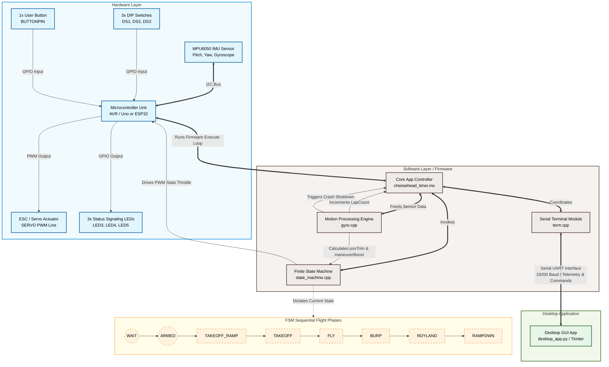

Cheesehead Timer — Operation Document

Overview
- Purpose: control-line airplane throttle sequencer with safety cutoffs and lap counting.
- Main files:
  - `cheesehead_timer.ino` — setup and main loop.
  - `gyro.cpp` / `gyro.h` — MPU6050 handling, lap counting, crash detection.
  - `state_machine.cpp` / `state_machine.h` — state transitions and throttle outputs.
  - `term.cpp` / `term.h` — serial terminal for diagnostics and configuration.
  - `led.cpp` / `led2.cpp` — LED indicators.

Hardware pins
- `SERVO` (pin defined in `cheesehead_timer.h`) — PWM to ESC/servo.
- `DS1`, `DS2`, `DS3` — dip switches; `DS3` used to disable some flight-phase checks when LOW.
- `LED3`,`LED4`,`LED5` — status LEDs.
- `BUTTONPIN` — user button input.

Configuration (stored in EEPROM via `param TimerSetup`)
- `FlySpeed[3]` — throttle values for profiles.
- `FlyTime[3]` — durations for FLY state (ms or secs as used).
- `ArmTime[3]`, `accelTime[3]` — timing for ARMED and TAKEOFF_RAMP.
- `PitchExThresh`, `YawRateExThresh` — crash thresholds.
- `LapCount` — stored lap count, units = tenths of a lap (1 = 0.1 lap).
- `LapLimit` — shutdown limit, units = tenths of a lap (0 disables).

Lap counting
- Implemented in `gyro.cpp` using angle Y readings from the MPU6050.
- Accumulates signed angle deltas and counts every 36° as one "tenth" of a lap (0.1 lap).
- `TimerSetup.LapCount` increments by tenths as the aircraft rotates.
- Displayed in the terminal as decimal laps (e.g., 1.5 means 1 and a half laps).

Lap limit behavior
- Set `LapLimit` via the terminal command `M <value>` where `<value>` may be fractional (e.g., `M 1.5` sets 1.5 laps).
- `LapLimit` is stored in EEPROM in tenths (so 1.5 laps -> stored as 15).
- When `LapCount >= LapLimit` the system performs shutdown: `run_state = false`, ESC throttle set to 0, and LEDs are turned off.
- If `LapLimit >= 1.0` (i.e., stored value >= 10), while in `FLY` state the program will switch to the `BURP` state when the lap count reaches `LapLimit - 1.0` (one full lap before the limit). This gives a final burp prior to shutdown.
- If `LapLimit < 1.0` the pre-burp trigger is not used; shutdown still occurs when the limit is reached.

BURP state
- `BURP` is a short-duration state that sets throttle to `BurpMax` (defined in `cheesehead_timer.h`).
- The program now automatically transitions to `BURP` when within one lap of the configured `LapLimit` while in `FLY`.
- Implementation detail: `setSpeedState(speed_state::BURP)` is used to change state and reset the state's timer.

Pitch trim
- The program computes a pitch-based trim (`posTrim`) from the MPU6050 pitch angle (`iangleX`).
- A sin-table mapping is used for smooth response; the user-configurable `TimerSetup.px` is the maximum trim magnitude (0..180).
- The computed trim range is `-px..+px`, and the sign is inverted so nose-up reduces throttle and nose-down increases throttle.
- `posTrim` is applied to the commanded throttle before writing to the ESC and clamped to 0..`MAX_SPEED`.
- `posTrim` is shown in the serial menu as `P  Pos trim` for live telemetry.

`posTrim` variable
- Defined/updated: `gyro.cpp` (computed in `speedGyro()`), declared `extern int posTrim;` in `cheesehead_timer.h`.
- Applied: added to `curThrottle` in `state_machine.cpp` before `esc.write()`; result is clamped to 0..`MAX_SPEED`.
- Units/range: integer throttle-adjust units; limited to `-TimerSetup.px` .. `+TimerSetup.px` (design), sign inverted so nose-up reduces throttle.
- Use: view `P  Pos trim` in the serial menu while tuning; adjust `TimerSetup.px` (menu `E`) to scale effect.

Maneuver boost (`maneuverBoost`)
- Defined/updated: `gyro.cpp` (computed in `speedGyro()`), declared `extern int maneuverBoost;` in `cheesehead_timer.h`.
- Purpose: provide an additional positive throttle increase for active maneuvering based on pitch magnitude.
- Source: scaled from `abs(iangleX)` (pitch magnitude) and `TimerSetup.rx` (maneuver gain). A small deadband prevents jitter for tiny pitch angles.
- Applied: added to the commanded throttle along with `posTrim` in `state_machine.cpp` before clamping and `esc.write()`.
- Configuration: set `TimerSetup.rx` via the serial menu with `K <value>` (0..180). Menu shows `R  Maneuver rx` and `B  Maneuver boost` for telemetry.

State machine (brief)
- States: WAIT, ARMED, TAKEOFF_RAMP, TAKEOFF, FLY, BURP, RDYLAND, RAMPDWN.
- `check_state()` handles timed transitions using `state_timer[]` array.
- `speedState()` sets `curThrottle` based on the current state and safety flags, and writes to the ESC via `esc.write(curThrottle)`.
- Safety flags (PitchEX, YawEX, YawLOW) are set by gyro checks and set `run_state = false` when triggered.

Crash detection and safety
- `gyro.cpp` evaluates per-sample pitch and yaw deltas using hysteresis counters to avoid noise-triggered false positives.
- If excessive pitch or yaw is detected (based on `PitchExThresh`, `YawRateExThresh`), `run_state` is cleared and throttle is set to 0 in the relevant logic.
- `DS3` when LOW disables some flight-phase checks during `FLY` (configurable behavior in code).

Serial terminal
- Open serial at 19200 baud.
- Press `?` to display the menu (`terminal()`).
- Common commands:
  - `a <profile> <speed>` — set `FlySpeed` for profile 1..3.
  - `b <profile> <time>` — set `FlyTime`.
  - `c <profile> <time>` — set `ArmTime`.
  - `d <profile> <ms>` — set `accelTime` (TAKEOFF_RAMP).
  - `h <value>` — set `PitchExThresh`.
  # Cheesehead Timer — Operation Document

  ## Overview

  - **Purpose:** control-line airplane throttle sequencer with safety cutoffs and lap counting.
  - **Main files:**
    - `cheesehead_timer.ino` — setup and main loop.
    - `gyro.cpp` / `gyro.h` — MPU6050 handling, lap counting, crash detection.
    - `state_machine.cpp` / `state_machine.h` — state transitions and throttle outputs.
    - `term.cpp` / `term.h` — serial terminal for diagnostics and configuration.
    - `led.cpp` / `led2.cpp` — LED indicators.

  ## Hardware pins

  - `SERVO` (pin defined in `cheesehead_timer.h`) — PWM to ESC/servo.
  - `DS1`, `DS2`, `DS3` — dip switches; `DS3` used to disable some flight-phase checks when LOW.
  - `LED3`,`LED4`,`LED5` — status LEDs.
  - `BUTTONPIN` — user button input.

  ## Configuration (stored in EEPROM via `param TimerSetup`)

  - `FlySpeed[3]` — throttle values for profiles.
  - `FlyTime[3]` — durations for FLY state (ms or secs as used).
  - `ArmTime[3]`, `accelTime[3]` — timing for ARMED and TAKEOFF_RAMP.
  - `PitchExThresh`, `YawRateExThresh` — crash thresholds.
  - `LapCount` — stored lap count, units = tenths of a lap (1 = 0.1 lap).
  - `LapLimit` — shutdown limit, units = tenths of a lap (0 disables).

  ## Lap counting

  - Implemented in `gyro.cpp` using angle Y readings from the MPU6050.
  - Accumulates signed angle deltas and counts every 36° as one "tenth" of a lap (0.1 lap).
  - `TimerSetup.LapCount` increments by tenths as the aircraft rotates.
  - Displayed in the terminal as decimal laps (e.g., 1.5 means 1 and a half laps).

  ## Lap limit behavior

  - Set `LapLimit` via the terminal command `M <value>` where `<value>` may be fractional (e.g., `M 1.5` sets 1.5 laps).
  - `LapLimit` is stored in EEPROM in tenths (so 1.5 laps -> stored as 15).
  - When `LapCount >= LapLimit` the system performs shutdown: `run_state = false`, ESC throttle set to 0, and LEDs are turned off.
  - If `LapLimit >= 1.0` (i.e., stored value >= 10), while in `FLY` state the program will switch to the `BURP` state when the lap count reaches `LapLimit - 1.0` (one full lap before the limit). This gives a final burp prior to shutdown.
  - If `LapLimit < 1.0` the pre-burp trigger is not used; shutdown still occurs when the limit is reached.

  ## BURP state

  - `BURP` is a short-duration state that sets throttle to `BurpMax` (defined in `cheesehead_timer.h`).
  - The program now automatically transitions to `BURP` when within one lap of the configured `LapLimit` while in `FLY`.
  - Implementation detail: `setSpeedState(speed_state::BURP)` is used to change state and reset the state's timer.

  ## Pitch trim

  - The program computes a pitch-based trim (`posTrim`) from the MPU6050 pitch angle (`iangleX`).
  - A sin-table mapping is used for smooth response; the user-configurable `TimerSetup.px` is the maximum trim magnitude (0..180).
  - The computed trim range is `-px..+px`, and the sign is inverted so nose-up reduces throttle and nose-down increases throttle.
  - `posTrim` is applied to the commanded throttle before writing to the ESC and clamped to 0..`MAX_SPEED`.
  - `posTrim` is shown in the serial menu as `P  Pos trim` for live telemetry.

  ### `posTrim` variable

  - **Defined/updated:** `gyro.cpp` (computed in `speedGyro()`), declared `extern int posTrim;` in `cheesehead_timer.h`.
  - **Applied:** added to `curThrottle` in `state_machine.cpp` before `esc.write()`; result is clamped to 0..`MAX_SPEED`.
  - **Units/range:** integer throttle-adjust units; limited to `-TimerSetup.px` .. `+TimerSetup.px` (design), sign inverted so nose-up reduces throttle.
  - **Use:** view `P  Pos trim` in the serial menu while tuning; adjust `TimerSetup.px` (menu `E`) to scale effect.

  ## Maneuver boost (`maneuverBoost`)

  - **Defined/updated:** `gyro.cpp` (computed in `speedGyro()`), declared `extern int maneuverBoost;` in `cheesehead_timer.h`.
  - **Purpose:** provide an additional positive throttle increase for active maneuvering based on pitch magnitude.
  - **Source:** scaled from `abs(iangleX)` (pitch magnitude) and `TimerSetup.rx` (maneuver gain). A small deadband prevents jitter for tiny pitch angles.
  - **Applied:** added to the commanded throttle along with `posTrim` in `state_machine.cpp` before clamping and `esc.write()`.
  - **Configuration:** set `TimerSetup.rx` via the serial menu with `K <value>` (0..180). Menu shows `R  Maneuver rx` and `B  Maneuver boost` for telemetry.

  ## State machine (brief)

  - States: WAIT, ARMED, TAKEOFF_RAMP, TAKEOFF, FLY, BURP, RDYLAND, RAMPDWN.
  - `check_state()` handles timed transitions using `state_timer[]` array.
  - `speedState()` sets `curThrottle` based on the current state and safety flags, and writes to the ESC via `esc.write(curThrottle)`.
  - Safety flags (PitchEX, YawEX, YawLOW) are set by gyro checks and set `run_state = false` when triggered.

  ## Crash detection and safety

  - `gyro.cpp` evaluates per-sample pitch and yaw deltas using hysteresis counters to avoid noise-triggered false positives.
  - If excessive pitch or yaw is detected (based on `PitchExThresh`, `YawRateExThresh`), `run_state` is cleared and throttle is set to 0 in the relevant logic.
  - `DS3` when LOW disables some flight-phase checks during `FLY` (configurable behavior in code).

  ## Serial terminal

  - Open serial at 19200 baud.
  - Press `?` to display the menu (`terminal()`).
  - **Common commands:**
    - `a <profile> <speed>` — set `FlySpeed` for profile 1..3.
    - `b <profile> <time>` — set `FlyTime`.
    - `c <profile> <time>` — set `ArmTime`.
    - `d <profile> <ms>` — set `accelTime` (TAKEOFF_RAMP).
    - `h <value>` — set `PitchExThresh`.
    - `j <value>` — set `YawRateExThresh`.
    - `l` — reset lap count to zero.
    - `m <value>` — set `LapLimit` in laps (fractional allowed; stored as tenths).
    - `k <value>` — set maneuver gain `rx` (0..180).
    - `s` — save `TimerSetup` to EEPROM.
    - `G` — run gyro calibration routine and save computed gyro offsets to EEPROM (stored in `TimerSetup.calX/calY/calZ`, units = deg/s * 100).
    - `u <value>` — set automatic throttle increase percent-per-minute while in `FLY` (0 disables). Example: `u 2` adds 2% of base throttle per minute.

  ## Defaults and initialization

  - On first run (or invalid EEPROM), defaults are set in `setup()` of `cheesehead_timer.ino` (example defaults for speeds, times, thresholds, and `LapLimit = 0`).
  - The MPU6050 is initialized in `mpu_setup()` and gyro offsets are calculated.
  - Factory reset now includes a default `autoSpeedPerMin` (2%/min) and calibration offsets are saved into `TimerSetup.calX/calY/calZ` when the `G` command is used.

  ## Notes and recommendations

  - Lap counting assumes reasonably clean rotations and that angle Y wraps in [-180,180]. Sudden jumps near wrap boundaries are handled by signed delta computation.
  - Because counting granularity is 0.1 lap, `LapLimit` should be chosen accordingly (e.g., set 0.1 increments for early testing).
  - The BURP-before-shutdown behavior only triggers while in `FLY`. If you want it active in other states, modify the condition in `gyro.cpp`.
  - Verify `DS3` wiring and intended behavior; it is used to relax flight-phase checks when LOW.

  ## File references

  - Main sketch: `cheesehead_timer.ino`
  - Gyro and lap logic: `gyro.cpp`
  - State machine and BURP: `state_machine.cpp`
  - Terminal/menu: `term.cpp`

  ## Contact

  - Original project author: Dave Siegler (ne9n) — email present in banner in `term.cpp`.

  ---
