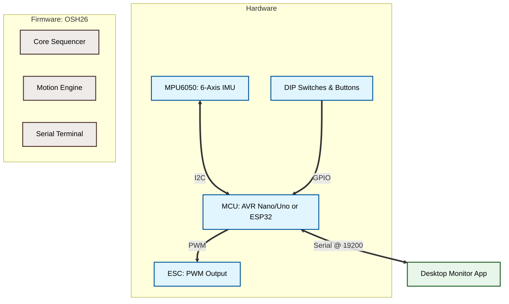

# 🧀 Cheesehead Timer OSH26
**A powerful, state-of-the-art Control Line (C/L) Throttle Sequencer for model aircraft.**
The **Cheesehead Timer** is a specialized firmware and desktop suite designed for control-line modelers who need precise throttle control, automated flight sequences, and advanced safety features. Built on a non-blocking state machine architecture, it integrates MPU6050 motion sensing to provide real-time flight adjustments and automated shutdown.
---
## ✨ Key Features
*   **Non-Blocking State Machine**: Handles flight phases (Takeoff, Fly, Burp, Landing) with sub-millisecond precision.
*   **Motion-Aware Throttle**: 
    *   `posTrim`: Automatically adjusts throttle based on pitch angle (Nose-up = power cut, Nose-down = power boost).
    *   `maneuverBoost`: Dynamic throttle increase during aggressive maneuvers.
*   **Precise Lap Counting**: Tracks flight progress in tenths-of-a-lap using high-speed gyro integration.
*   **Safety First**: Automatic motor cut-off on excessive pitch or yaw detection (crash prevention).
*   **Pre-Shutdown Warning**: Performs a throttle "BURP" exactly one lap before the timed/counted limit.
*   **Modern Desktop Interface**: Dedicated Python/Tkinter app for real-time monitoring and easy firmware flashing.
*   **SRAM Optimized**: Heavily utilizes `F()` macros and efficient data structures for stable operation on limited hardware (Arduino Nano/Uno).
---
## 🛠 Hardware Architecture

```mermaid
graph TD
    classDef hardware fill:#e1f5fe,stroke:#01579b,stroke-width:2px,color:#000;
    classDef software fill:#efebe9,stroke:#4e342e,stroke-width:2px,color:#000;
    classDef desktop fill:#e8f5e9,stroke:#1b5e20,stroke-width:2px,color:#000;
    subgraph Hardware [Hardware]
        MCU[MCU: AVR Nano/Uno or ESP32]:::hardware
        MPU[MPU6050: 6-Axis IMU]:::hardware
        ESC[ESC: PWM Output]:::hardware
        Inputs[DIP Switches & Buttons]:::hardware
    end
    subgraph Firmware [Firmware: OSH26]
        CORE[Core Sequencer]:::software
        GYRO[Motion Engine]:::software
        TERM[Serial Terminal]:::software
    end
    APP[Desktop Monitor App]:::desktop
    MPU <==>|I2C| MCU
    MCU ==>|PWM| ESC
    Inputs ==>|GPIO| MCU
    MCU <==>|Serial @ 19200| APP
```
---
## 🚀 Quick Start
### 1. Requirements
*   **Hardware**: Arduino Nano (ATmega328P), MPU6050, 3x LEDs, 3x DIP switches.
*   **Software**: Arduino IDE or PlatformIO.
### 2. Installation
1.  Clone this repository:
    ```bash
    git clone https://github.com/ne9n/new-timer.git
    ```
2.  Open `cheesehead_timer.ino` in your IDE.
3.  Install dependencies: `MPU6050_tockn`.
4.  Upload to your board.
### 3. Desktop App
The repository includes a desktop application for easy configuration:
1.  Install Python 3.
2.  Install requirements: `pip install customtkinter pyserial`.
3.  Run the app: `python desktop_app.py`.
---
## 🧭 Axis Mapping (X, Y, Z)
The OSH26 version allows you to physically orient your MPU6050 in any direction and remap the software axes via the serial menu:
|
 Command 
|
 Function 
|
 Values 
|
|
:---
|
:---
|
:---
|
|
`1 <val>`
|
 Map 
**
Pitch
**
 Axis 
|
 0=X, 1=Y, 2=Z 
|
|
`2 <val>`
|
 Map 
**
Roll
**
 Axis 
|
 0=X, 1=Y, 2=Z 
|
|
`3 <val>`
|
 Map 
**
Yaw
**
 Axis 
|
 0=X, 1=Y, 2=Z 
|
*Don't forget to send `s` to save your mapping to EEPROM!*
---
## 📝 Configuration Commands
Connect via the Serial Monitor (19200 baud) and press `?` to see the full menu:
*   `a <prof> <speed>`: Set flight speed for profile 1-3.
*   `M <laps>`: Set Lap Limit (e.g., `M 10.5` for 10.5 laps).
*   `G`: Run automated Gyro Calibration.
*   `L`: Reset lap counter.
---
## 🤝 Attribution
*   **Author**: Dave Siegler (ne9n)
*   **Contact**: ne9n.dave@gmail.com
*   **GitHub**: [ne9n](https://github.com/ne9n)
---
*Maintained with ❤️ for the Control Line community.*
