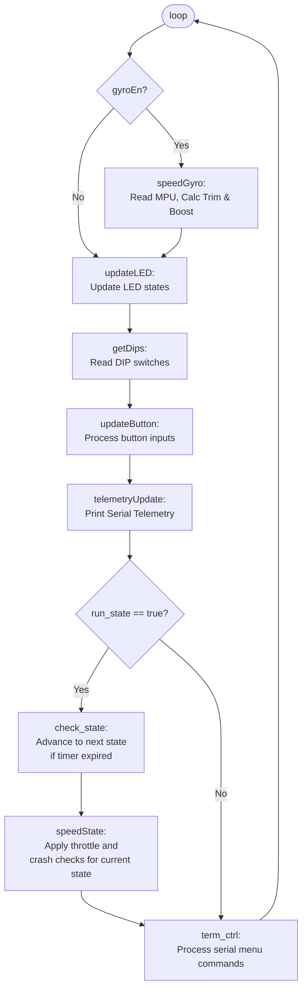
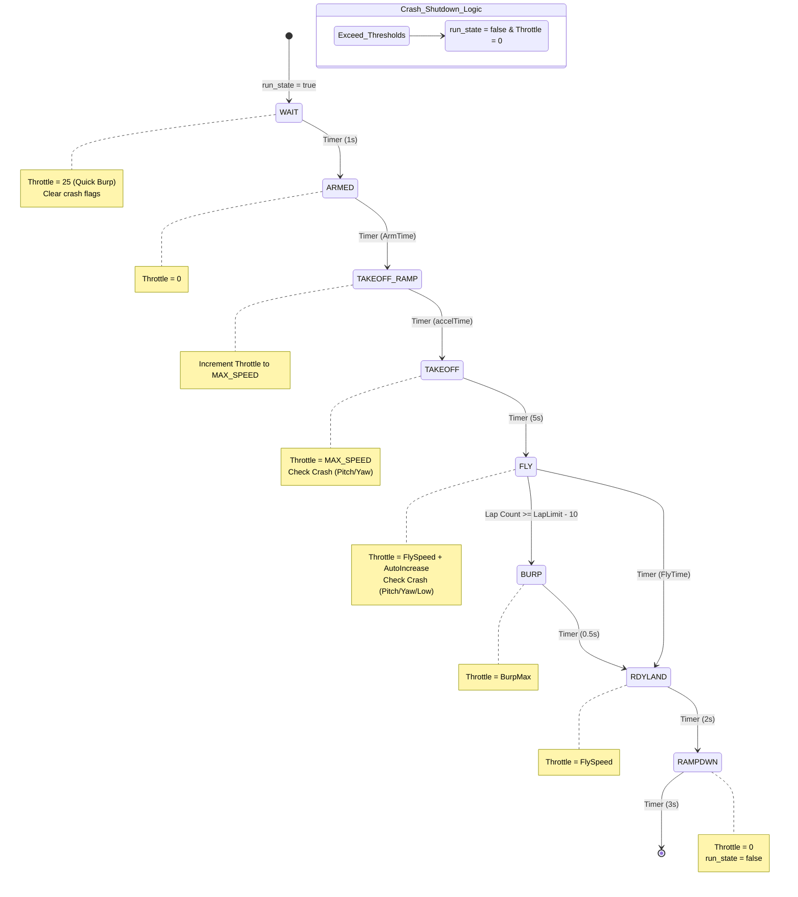
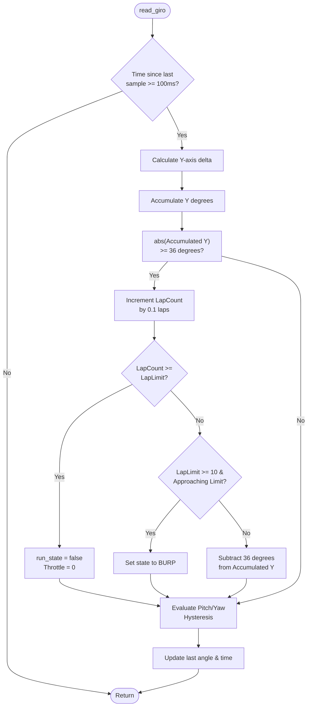

# Cheesehead Timer Flowcharts

Here are the flowcharts detailing the core logic and state progression of the Arduino firmware.

## Main Execution Loop

This flowchart outlines the main `loop()` function in `cheeshead_timer.ino`, showing the order of operations for reading sensors, updating outputs, and processing the state machine.

## Speed State Machine

This state diagram outlines the `speed_state` machine found in `state_machine.cpp`. It details the throttle behavior and transition conditions for each flight phase.

## Lap Logic (Gyro)

This flowchart outlines the lap counting and shutdown logic processed inside `read_giro()` in `gyro.cpp`.

