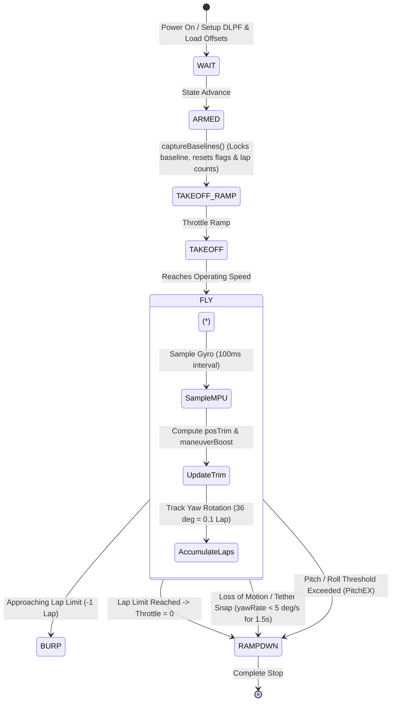

# Gyroscope Operation & Motion Control Documentation

This document describes the design, implementation, and operation of the gyroscope subsystem in the **Cheesehead Timer** control system (`gyro.cpp`, `gyro.h`, and `state_machine.cpp`).

---

## 1. Overview & Hardware Configuration

* **Sensor:** InvenSense MPU6050 6-axis accelerometer/gyroscope connected via I2C (`Wire`).
* **Sampling Rate:** `GYRO_SAMPLE_MS = 100` (10 Hz loop in `processGyroSafety()`).
* **Low-Pass Filter (DLPF):** Hardware DLPF configured to **5 Hz** (Register `0x1A`, value `0x06`) during `mpu_setup()` to filter out high-frequency electric motor vibration.
* **Calibration & Offsets:** Gyro offsets are persisted in EEPROM (`TimerSetup.calX`, `TimerSetup.calY`, `TimerSetup.calZ`). High-precision auto-calibration (`setUpMPU()`) calculates bias across 200 samples when static.

---

## 2. Start of Motion (Arming & Takeoff Phase)

### A. Baseline Lock (`captureBaselines()`)
When the flight state machine transitions to the `ARMED` state (prior to motor ramp up):
1. **Reference Capture:** Samples 10 consecutive pitch, roll, and yaw measurements to establish `baselinePitch`, `baselineRoll`, and `baselineYaw`.
2. **State Reset:**
   * Resets safety flags (`PitchEX = false`, `YawEX = false`, `YawLOW = false`).
   * Resets lap count and accumulated rotation (`LapCount = 0`, `accumulatedY = 0.0f`).
   * Clears moving-average history buffers (`pdHistory`, `rdHistory`).

### B. Takeoff Ramp (`TAKEOFF_RAMP` & `TAKEOFF`)
1. The electronic speed controller (ESC) ramps throttle up to `FlySpeed` over the duration set by `accelTime`.
2. `yawSlowCount` tracks initial rotation samples following takeoff to prevent premature false-positive "yaw loss" triggers while the aircraft accelerates from rest to full speed.

---

## 3. In-Flight Gyro Processing (`updateGyro()`)

During flight (`FLY` state), `updateGyro()` executes `updateGyroTrim()` and `processGyroSafety()` on every loop iteration:

### A. Angle Normalization & Attitude Tracking
* Converts raw readings into relative angles normalized to $[-180^\circ, +180^\circ]$.
* Maps axes based on user configuration (`TimerSetup.axisPitch`, `axisRoll`, `axisYaw`).

### B. Dynamic Pitch Trim (`posTrim`)
* Evaluates pitch angle (`iangleX`) using a sine lookup table (`sinetbl`).
* When nose-up pitch is detected, negative trim (`posTrim`) is applied to reduce ESC throttle and automatically level the aircraft.

### C. Maneuver Boost (`maneuverBoost`)
* Calculates extra power output scaled by `TimerSetup.rx` during significant pitch excursions to aid pitch maneuvers.

### D. Lap Counting & Lap Limit Logic
* Continuously accumulates yaw rotation delta ($\Delta \text{Yaw}$) into `accumulatedY`.
* Every $36^\circ$ corresponds to $0.1$ lap ($360^\circ = 1.0$ lap).
* Updates `TimerSetup.LapCount`.

---

## 4. Stop of Motion & Safety Shutdowns

The gyro system continuously monitors for both **intentional stops** (completing programmed laps) and **unintentional stops** (crash, tether breakage, or loss of motion).

### A. Unintentional Stop / Loss of Motion (`YawLOW`)
* **Yaw Loss / Rest Detection:** In `FLY` mode, if the yaw rotation rate drops below the slow limit or stops completely ($|\text{yawRate}| < 5^\circ/\text{sec}$) for 1.5 seconds (`YAW_LOW_M = 15` samples):
  * Indicates loss of circular line-flying motion (e.g., tether breakage or landing/crash).
  * **Action:** Triggers `YAW LOSS SHUTDOWN`, forces ESC throttle to zero (`esc.write(0)`), and halts active flight state (`run_state = false`).

### B. Excessive Pitch / Roll / Spin Trip (`PitchEX` / `YawEX`)
* **Pitch/Roll Trip (`PitchEX`):** Smooths pitch/roll deviations from baseline using a 5-sample moving average. Exceeding `PitchExThresh` for 1.5 seconds (`PITCH_SET_N = 15` samples) trips safety and cuts motor power.
* **Excessive Yaw Spin (`YawEX`):** Yaw rate exceeding $250^\circ/\text{sec}$ for 2 consecutive samples triggers an immediate shutdown.

### C. Programmed Flight End / Landing Sequence
1. **Pre-Limit Burp:** Upon reaching 1 lap before `LapLimit`, state switches to `BURP` (brief throttle pulse).
2. **Lap Limit Reached:** Reaching `LapLimit` halts `run_state`, cuts ESC power (`esc.write(0)`), and turns off status LEDs.
3. **Landing Phase:** The system transitions through `RDYLAND` to `RAMPDWN`, bringing the aircraft to a full stop.

---

## 5. State Diagram

